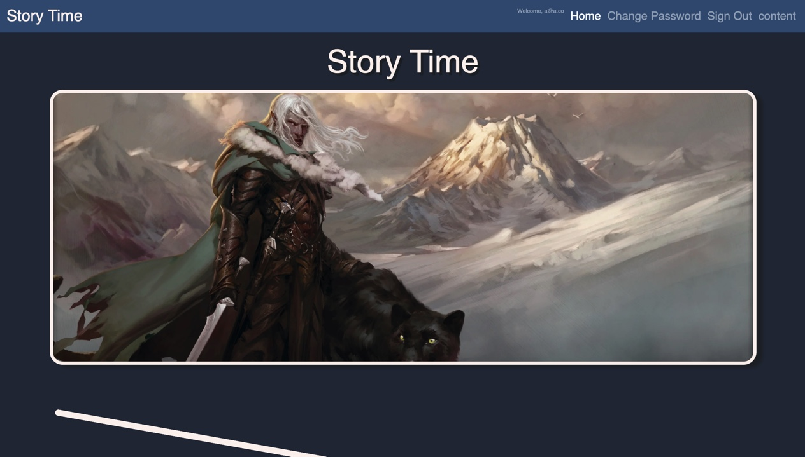

### Description
Story time is an app that allows anyone who is signed up to write a story. Every
story will have a title and you can add chapters to that story for content. The
stories will be well organized and only you can view them. However functionality
for others to view them shall be coming soon.

### Repo's

[Client Repo](https://github.com/JintekiWarrior/Story_Time_Frontend)
[Server Repo](https://github.com/JintekiWarrior/Story_Time_Backend)

### WireFrame's
[Wireframes](https://imgur.com/gallery/hAbRPI4)

### User Stories
As a writer I want a title for my story
As a writer I want to add chapter's to my story
As a writer I want to edit my stories
As a writer I want to view my stories

### Relationship
User -|--< Stories -|--< Chapters

### Technologies
React, Javascript, HTML, CSS, Django, Python, Postgres

### Unsolved Issues
- Other users cannot see your created stories
- User's cannot add to others stories
- User's cannot comment or like other's stories

### Strategy
Used the github khanban board to plan the project. After a todo tab was done it
was moved to the completed pile. Any issues ran into were googled to find the
answer. If too much time was bieng spent on the issue, a project issue tab
was opened and an instructor would guide me to the right answer.
